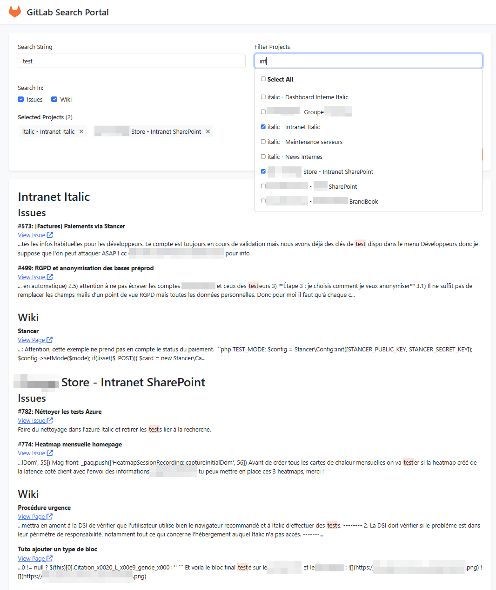

# GitLab Search Portal

A web application that allows you to search for strings across GitLab issues and wikis in a self-hosted GitLab instance.



## Features

- Project filtering with autocomplete dropdown and multi-select checkboxes
- String search across GitLab issues and wikis in selected projects
- Secure API key management using .env files
- Organized results display by project and content type (issues/wiki)
- Content excerpts with highlighted search terms
- Direct links to original GitLab items

## Requirements

- PHP 7.4 or higher
- Composer
- Web server (Apache or Nginx)
- Access to a GitLab instance with API access

## Installation

1. Clone this repository or download the files
2. Run `composer install` to install dependencies
3. Copy `.env.dist` to `.env` and update with your GitLab instance URL and API key:

   ```
   GITLAB_URL=https://gitlab.example.com
   GITLAB_API_KEY=your_private_token_here
   ```

## Development Setup

### Using PHP's Built-in Server

For development, you can use PHP's built-in server:

```bash
cd /path/to/project
php -S localhost:8080
```

Then open [http://localhost:8080](http://localhost:8080) in your browser.

### Using Apache

1. Create a virtual host in your Apache configuration:

```apache
<VirtualHost *:80>
    ServerName gitlab-search.local
    DocumentRoot /path/to/project
    
    <Directory /path/to/project>
        Options -Indexes +FollowSymLinks
        AllowOverride All
        Require all granted
    </Directory>
    
    ErrorLog ${APACHE_LOG_DIR}/gitlab-search-error.log
    CustomLog ${APACHE_LOG_DIR}/gitlab-search-access.log combined
</VirtualHost>
```

2. Add the domain to your hosts file:
```
127.0.0.1 gitlab-search.local
```

3. Restart Apache:
```bash
sudo service apache2 restart
```

### Using Nginx

1. Create a server block in your Nginx configuration:

```nginx
server {
    listen 80;
    server_name gitlab-search.local;
    root /path/to/project;
    index index.php index.html;

    location / {
        try_files $uri $uri/ /index.php?$query_string;
    }

    location ~ \.php$ {
        fastcgi_pass unix:/var/run/php/php7.4-fpm.sock;  # Adjust PHP version
        fastcgi_index index.php;
        fastcgi_param SCRIPT_FILENAME $document_root$fastcgi_script_name;
        include fastcgi_params;
    }

    location ~ /\.ht {
        deny all;
    }
}
```

2. Add the domain to your hosts file:
```
127.0.0.1 gitlab-search.local
```

3. Restart Nginx:
```bash
sudo service nginx restart
```

## Production Deployment

### Apache (LAMP) Setup

1. Upload files to your production server:
```bash
# Using SFTP or your preferred method
scp -r * user@your-server:/var/www/gitlab-search/
```

2. Set proper permissions:
```bash
cd /var/www/gitlab-search
sudo chown -R www-data:www-data .
sudo chmod -R 755 .
sudo chmod -R 777 logs    # If you have a logs directory
```

3. Create Apache virtual host:
```apache
<VirtualHost *:80>
    ServerName search.yourdomain.com
    DocumentRoot /var/www/gitlab-search
    
    <Directory /var/www/gitlab-search>
        Options -Indexes +FollowSymLinks
        AllowOverride All
        Require all granted
    </Directory>
    
    ErrorLog ${APACHE_LOG_DIR}/gitlab-search-error.log
    CustomLog ${APACHE_LOG_DIR}/gitlab-search-access.log combined
</VirtualHost>
```

4. Enable the site and restart Apache:
```bash
sudo a2ensite gitlab-search.conf
sudo service apache2 restart
```

### Nginx (LEMP) Setup

1. Upload files as described above

2. Create Nginx server block:
```nginx
server {
    listen 80;
    server_name search.yourdomain.com;
    root /var/www/gitlab-search;
    index index.php;

    location / {
        try_files $uri $uri/ /index.php?$query_string;
    }

    location ~ \.php$ {
        include snippets/fastcgi-php.conf;
        fastcgi_pass unix:/var/run/php/php7.4-fpm.sock;  # Adjust PHP version
    }

    location ~ /\.ht {
        deny all;
    }

    # Add security headers
    add_header X-Frame-Options "SAMEORIGIN";
    add_header X-XSS-Protection "1; mode=block";
    add_header X-Content-Type-Options "nosniff";
}
```

3. Enable the site and restart Nginx:
```bash
sudo ln -s /etc/nginx/sites-available/gitlab-search.conf /etc/nginx/sites-enabled/
sudo service nginx restart
```

### SSL Configuration

For production, always use HTTPS. You can obtain free SSL certificates using Let's Encrypt:

```bash
sudo certbot --nginx -d search.yourdomain.com
```

## Security Considerations

1. Keep your `.env` file secure and never commit it to version control
2. Use strong API tokens with minimal required permissions
3. Regularly update dependencies:
   ```bash
   composer update
   ```
4. Configure proper file permissions
5. Enable HTTPS in production

## License

MIT